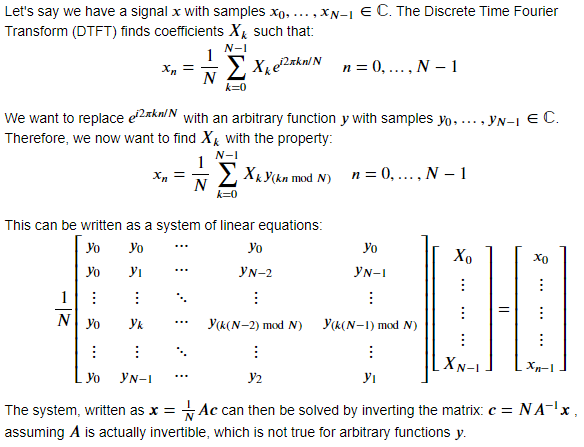

# Requirements

**Python 3.8+**

**Python modules**:
- numpy
- matplotlib
- tqdm

# Youtube video

<ins>**https://youtu.be/nwAKu01ESlY**</ins>

# Description
`viz.ipynb` contains all the code necessary to generate the animations shown in the video.

# Fourier Transform with arbitrary basis

